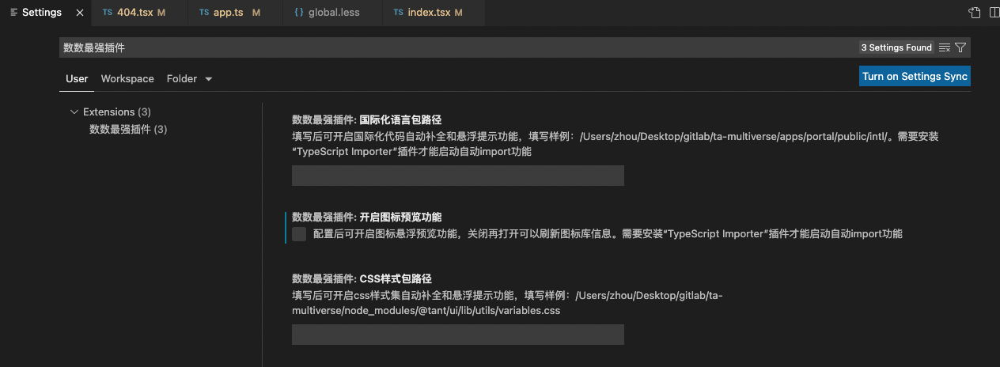
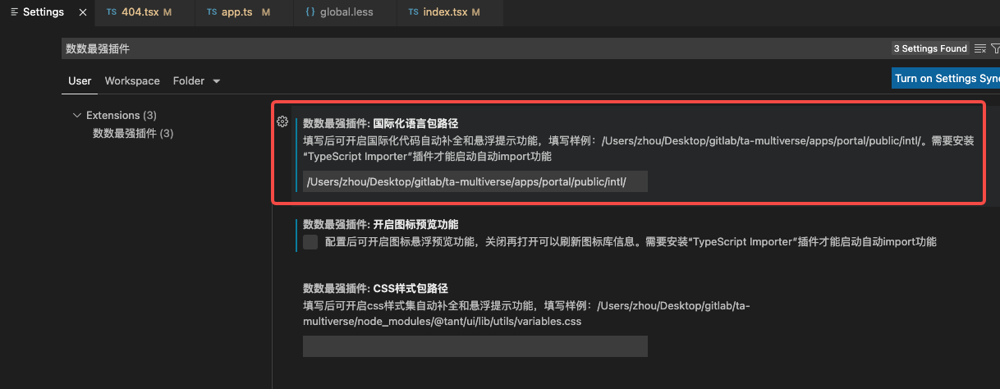
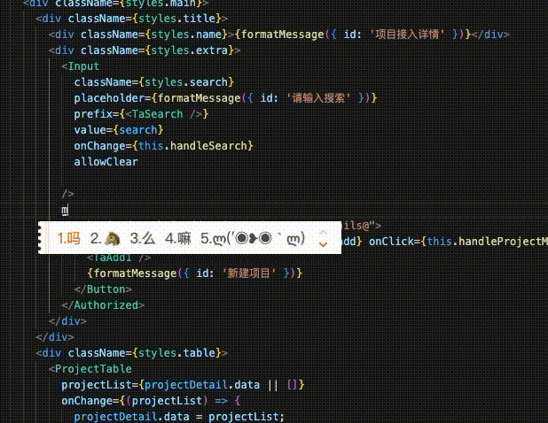
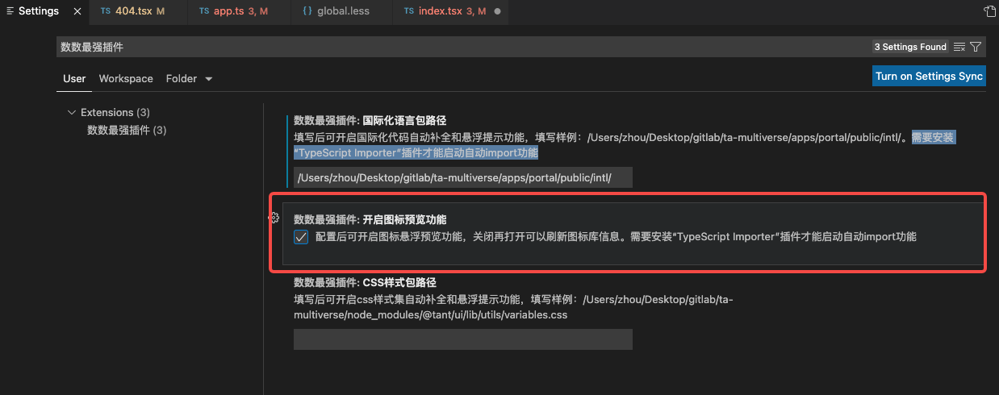
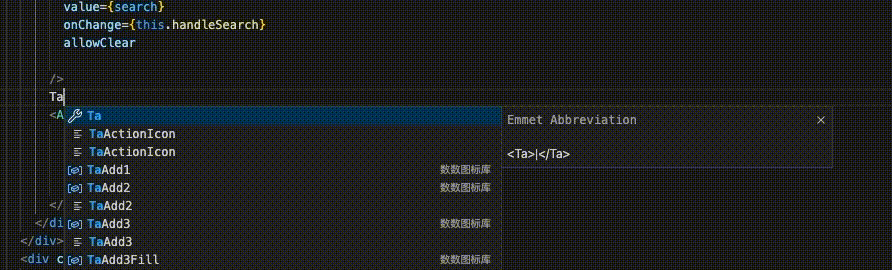
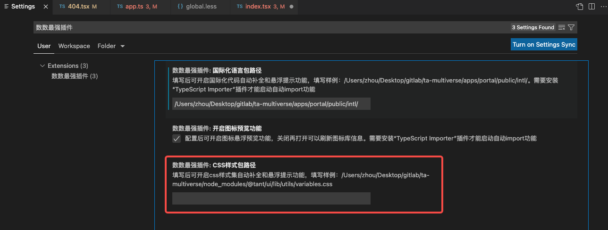
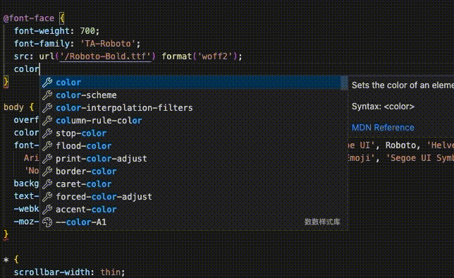

# 数数最强插件

## 描述
此插件是专门给数数科技的花粉会成员打造的一款好用且方便的插件，涵盖国际化、图标、样式库等插件场景。其他无关用户请勿使用。

## 配置
按”command+,“打开设置中心，搜索”数数最强插件“即可查看到配置。  

## 设置国际化功能
找到”数数最强插件.国际化语言包路径“并填入国际化语言包路径，包在portal的public/intl目录下，所以设置到粘贴intl的绝对路径即可。  
不填写的话则配置关闭。  
**注意：需要安装“TypeScript Importer”插件才能启动自动import功能**

## 设置图标库功能
找到”数数最强插件.开启图标预览功能”并勾选即可
**注意：需要安装“TypeScript Importer”插件才能启动自动import功能**

## 设置样式库功能
找到”数数最强插件.css样式包路径”并填入css文件路径，包在node_modules的@tant/ui/utils目录下
不填写的话则配置关闭。 

